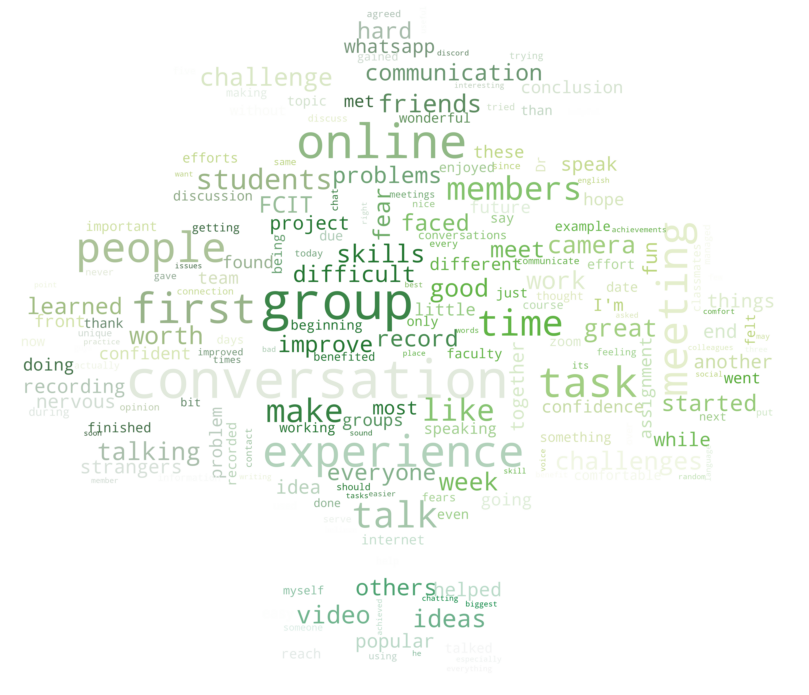
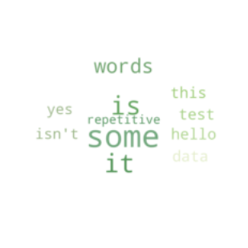

# Table of Contents
- [Table of Contents](#table-of-contents)
- [What is this?](#what-is-this)
- [How does it work?](#how-does-it-work)
	- [Dependencies](#dependencies)
	- [Scraping the Data](#scraping-the-data)
		- [Initialize the Browser Driver](#initialize-the-browser-driver)
		- [Opening a site](#opening-a-site)
		- [Retrieving Blog Links](#retrieving-blog-links)
		- [Retrieving Text Data](#retrieving-text-data)
	- [Processing Data](#processing-data)
		- [Loading the Data](#loading-the-data)
		- [Removing newlines](#removing-newlines)
		- [Selecting all the words present](#selecting-all-the-words-present)
		- [Getting the Frequency of Each Word](#getting-the-frequency-of-each-word)
		- [Saving the Data](#saving-the-data)
	- [Visualizing the Data](#visualizing-the-data)
		- [Load the processed data](#load-the-processed-data)
		- [Load the target image](#load-the-target-image)
		- [Creating the WordCloud Object](#creating-the-wordcloud-object)

# What is this? 
As part of our CPIT221 course, we write a weekly blog. In our previous week's blog, we wrote about our experiences in a group discussion, where the members were chosen at random. 

As someone who likes data, it was a no brainer to scrape and visualize that data, so this is the end result:

<p align="center"></p>

If it wasn't obvious, the size of the text correlates to how frequent the word appears in all the blogs.

# How does it work?
I split the code for this project into three distinct parts:
- **Scraping** Data
- **Processing** Data
- **Visualizing** Data

Of course, to achieve this, we will need to install some dependencies.

## Dependencies
To view and run the code, you will need to use a [Jupyter Notebook](https://jupyter.org). Alternatively, [Read this and run the .py files](./pythonFiles/pythonFiles.md).

Visual Studio Code has Jupyter Notebook support built into it's [Python Extention](https://marketplace.visualstudio.com/items?itemName=ms-python.python), and that is what I have used for this project.

Additionally, you will need to install:
- [Selenium Webdriver Library](https://pypi.org/project/selenium/) 
- [Selenium Chrome Driver](https://chromedriver.chromium.org/downloads), Make sure to either add it to the PATH or place it in the project's Current Working Directory
- [Matplotlib](https://pypi.org/project/matplotlib/)
- [WordCloud](https://pypi.org/project/matplotlib/)


## Scraping the Data
This was achieved by using Selenium's Webdriver for Python. Although it's intended use is for [Integration Testing](https://en.wikipedia.org/wiki/Integration_testing), we can also use it to automate browser actions and effectively scrape data from the browser.

Previously, I have used Python's Interactive Shell for web scraping and browser automation. However, with this project I decided to finally use Jupyter Notebooks, which has autocompletion and allows you to tinker with the code in real time. The main application of Jupyter Notebooks here is the ability to run code in blocks called 'Cells' which is useful in the tedious process of scraping data.

### Initialize the Browser Driver
```py
driver = webdriver.Chrome()
```

### Opening a site
```py
driver.get("https://website.web.edu.sa")
```
Then, we will manually log in and move to the weekly writing blogs.

### Retrieving Blog Links

After correctly moving to the right page, we can scrape all the blog links with the code below.
```py
def getBlogs():
    # Get List Element containing all the blog links
    blogList = driver.find_element_by_xpath("/html/body/div[5]/div[2]/div/div/div/div/div[3]/div/div[2]/div[4]/div/ul")

    # Retrieve children of <ul> element
    return blogList.find_elements_by_class_name("user")

def getLinks(blgs):
    # Retrieve anchor links in every list element
    return [e.find_element_by_tag_name("a").get_property("href") for e in blgs]

blogs = getBlogs()
blogLinks = getLinks(blogs)
```

### Retrieving Text Data

For Every URL, we will scrape the text from each blog as follows:
```py
def loadPageAndScrapeBlog(url):
    sleep(2) # Sleep while the previous page loads
    driver.get(url) # Redirect to blog URL
    e = driver.find_elements_by_class_name("entryText") # Select the element containing the blog text
    return e[0].text # Obtain the raw text from the latest blog element

blogTexts = [loadPageAndScrapeBlog(url) for url in blogLinks] # Repeat for every URL
```

We now have all the text we need to start processing the data. 

However to avoid losing the scraped text, I have saved it as a JSON file:

```py
# File Context Manager, closes the file pointer automatically
with open("rawBlogText.json", 'w') as file: 
        json.dump(blogTexts, file, indent=2) # Save data as JSON 
```

## Processing Data
Although we could go straight into visualizing the data, there is some inconsistencies in the data we can filter out, such as spacing, capitalization, and newline characters (`\n`).

### Loading the Data
The first step here is to load the text array which we have saved last time, and append it together into one big string.
```py
import json
import re # Regular Expressions Library
from collections import Counter

# Retrieve data
with open("rawBlogText.json", "r") as f: 
    data = json.load(f) 

# Concatenate Data
textData = " ".join(data)
```

### Removing newlines
```py
textData = textData.replace("\n", " ") # Simply replace the newlines with a " "
```

### Selecting all the words present
To achieve this I wrote a [Regular Expression](https://en.wikipedia.org/wiki/Regular_expression), to match strings which match a certain pattern. Here, it is looking for any case insensitive sequence of characters which contains letters from A to Z, or `'`.

```py
words = re.findall(r"[a-z\']+", newData, flags=re.IGNORECASE) # Get individual words
```
This will give us an array of all the words present in the string.

```py
['hello', 'this', 'IS', 'SOME', 'tEsT', 'Data', "isn't", 'it', 'Yes', 'it', 'is',
'Some', 'soMe', 'repeTitive', 'wOrds', 'worDs']
```

However, as you can see, there are repeating words, however we need to convert them into lowercase.

```py
words = [w.lower() for w in words]
```

Result:

```py
['hello',  'this', 'is', 'some', 'test', 'data', "isn't", 'it', 'yes', 'it', 'is',
 'some', 'some', 'repetitive', 'words', 'words']
 ``` 

### Getting the Frequency of Each Word
You could write a complex algorithm to efficiently find the number of repetitions in an array. However, this is Python, where there is a library for everything. In the `collections` package, there is a `Counter` class which we can use for this purpose.

```py
# Get a sorted dictionary of the top 1000 words from an array
sortedWords = dict(Counter(words).most_common(1000)) 
```

This is the final form our data will take, and we can now easily visualize it in the next section.

```py
{
  "some": 3, "is": 2, "it": 2, "words": 2, "hello": 1, "this": 1, "test": 1, "data": 1, "isn't": 1, "yes": 1, "repetitive": 1
}
```

However, you will need to remove the meaningless words manually, such as `it, and, a, the`, and so on.

### Saving the Data
As with the previous section, we will save the data as a JSON file.
```py
with open('processedData.json', "w") as file:
    json.dump(sortedWords, file, indent=2)
```

## Visualizing the Data
To visualize the data, I used the [wordcloud](http://amueller.github.io/word_cloud/index.html) library.


Most of this section is straight out of the [Wordcloud Documentation](http://amueller.github.io/word_cloud/auto_examples/colored.html#sphx-glr-auto-examples-colored-py), however I'll try my best at explaining how the code functions.

### Load the processed data
```py
# Load Word/Frequency Data
wordAndFrequencyData = json.load(open("processedData.json", "r"))
```

### Load the target image
From reading the documentation, I realized that you could superimpose text into an existing picture, called a `mask`. Therefore, I chose the FCIT Logo for this purpose.


```py
# Load Image which text will be superimposed onto
imageMask = np.array(Image.open("logo.jpg"))

# Generate colors from Image
imageColors = ImageColorGenerator(imageMask)
```

### Creating the WordCloud Object
We will then create a WordCloud object,
- Set the `scale` to 5, This number configures the resolution of the image
- Change the `background` to white
- Set the `mask` to the Loaded Image
```py
# Create WordCloud object with image
wordCloudObject = WordCloud(scale=5, background_color="white", mask=imageMask) 
```

We will then pass in the [Word - Frequency data](#getting-the-frequency-of-each-word), which is already in the form needed for the Word Cloud.

```py
# Pass in Word: Frequency to be displayed
wordCloudObject.generate_from_frequencies(wordAndFrequencyData)
```

Then, we wil pass in the WordCloud object into matplotlib, and display the chart.



```py
# Remove Axis markings
plt.axis("off")

# Display as Matplotlib Chart
plt.imshow(wordCloudObject.recolor(color_func=imageColors), interpolation="bilinear")
plt.show()
```
